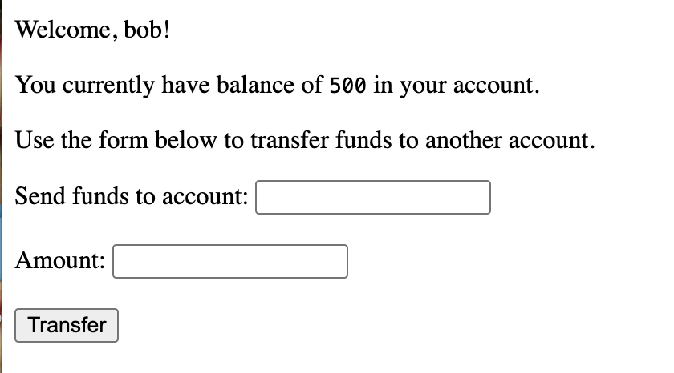
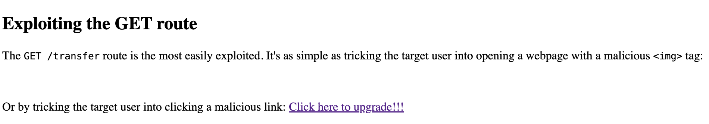
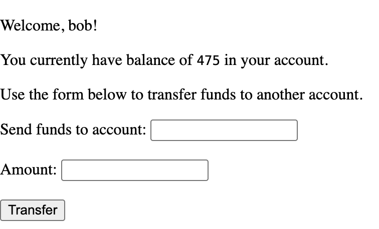
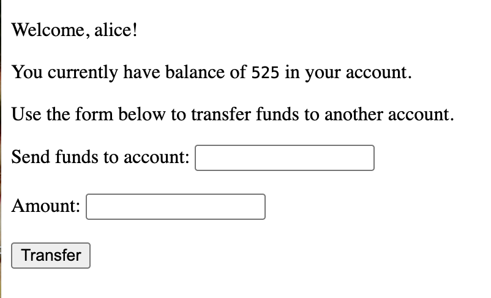
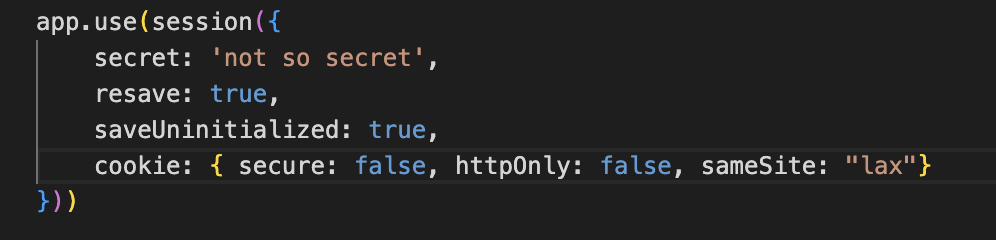

# Lab Source
This lab is based on the MIT‑licensed CSRF demo from:
https://github.com/Learn-by-doing/csrf-examples

I used this project as the vulnerable application for demonstrating a Cross-Site Request Forgery (CSRF) attack.

## 1. Environment Setup

To set up the environment, I installed dependencies and started the servers with:

```bash
npm install
npm start
```

Two servers are involved:
- Target site (victim): http://localhost:3000/
- Malicious site: http://localhost:3001/

The target site simulated a simple banking application, while the malicious site was used to execute the CSRF attack by tricking a user to perform unintended actions.

In the target site, there are two accounts: Bob and Alice. They both had a balance of 500.

I then logged into the target site with the test account, Bob.



## 2. Cross-Site Request Forgery Attack Using HTTP `GET` Requests

CSRF attacks can be performed with any HTTP method, but in practice they most commonly exploit `GET` and `POST` requests.

In this section, I demonstrate how a `GET` request can be used to carry out a CSRF attack.

In the repository, there is a file named `evil-examples.html` which is a simple page hosted on the malicious site. This page includes a section designed to exploit the application using a HTTP `GET` Request.


Listed are two examples of how a CSRF attack can be triggered using a `GET` request.

The first example uses a malicious hyperlink. When opening the malicious site the page displays a link labeled as, "Click here to upgrade!!!"



If the user is already logged into the target site (in this case, Bob), clicking the link would steal part of Bob's funds and transfer them to Alice's account.




Once I executed the attack, I restarted the servers to restore Bob and Alice's original account balances.

The second example uses the HTML `` tag to trigger the `GET` request. I enabled the `` tag in `evil-examples.html` and logged back into Bob's account in the target site.

This time, the attack immediately executed upon visiting the malicious site.


These attacks were possible because:
1. When logged in as Bob, the target site created a session cookie for him.
    - A session cookie is a small piece of data the server gives the browser when a user logs in. The browser automatically sends it with every HTTP request so the server knows which user is making the request.
2. The server also exposes a method that allows users to transfer money using a `GET` Request.


This is not ideal since as described, these types of requests can be triggered by HTML elements like `` tags or links without the user knowing. Since Bob’s browser automatically sent his session cookie with those requests, the server assumed Bob intentionally made them. As a result, the server transferred money from Bob’s account to Alice’s account even though Bob never meant to do so.

One improvement is to replace the transfer `GET` request with a method that uses `POST` instead. This helps avoid accidental triggering through elements like images or links. However, changing the request type by itself does not prevent CSRF attacks. An attacker can still perform CSRF attacks even without `GET` requests.

In general, any action that modifies data should never use a `GET` request. It should use a `POST` request or another HTTP method for state changing operations.

## 3. Cross-Site Request Forgery Attack Using HTTP `POST` Requests

Even if the server does not use `GET` requests to modify data, CSRF attacks can still happen. In this example, this attack uses malicious `POST` requests.

There is a section in `evil-examples.html` for demonstrating a HTTP `POST` request CSRF attack. I implemented the `POST` request attack in my example.


In my implementation, JavaScript is used to create a hidden HTML form and prefill it with specific values. After the form is added to the page, the script automatically submits it as soon as the page loads.

The form in this case exploits the transfer method in the server that uses a `POST` request, where it will transfer money into Alice's account from any logged in user.


To test this attack, I restarted the servers and logged in as Bob on the target site. When I then visited the malicious page, some of Bob's funds were transferred to Alice's account.


This confirmed that the `POST` Request CSRF attack worked. Even though Bob never submitted the form himself, his browser automatically included his session cookie when loading the malicious page. Because the server trusted that cookie, it treated the `POST` request from the invisible form as if Bob intentionally submitted it, which caused some of Bob's funds to transfer to Alice's account.

## 4. Countermeasures to CSRF attacks

There are two main countermeasures from preventing CSRF attacks: same-site cookies and secret tokens.

This is an attribute applied to cookies by the server. It tells the browser whether a cookie should be sent along with cross-site requests or not.

The possible values are:
- Strict
    - Cookie is only sent in a first-party context (when the user is browsing the same site that set the cookie).
    - Cookies are never sent in cross-site requests.
- Lax
    - Cookie is not sent on most cross-site requests (like images, scripts, or POST forms).
    - Cookie is sent on top-level cross-site navigation (user actively requests a page change), such as when the user clicks a link.
- None
    - Cookie is always sent, regardless of whether the request is first-party or cross-site.

In the example below, the same-site attribute for our cookie is set as lax. The malicious site still attempts a CSRF attack using an HTTP `POST` request.



I restarted the servers and opened up the target application at http://localhost:3000/. Then, I opened up the malicious server at http://127.0.0.1:3001 and logged into Bob's account on the target site.

What I found was that Bob's account balance remained unchanged, which is as expected. This was because I attempted to perform the attack using a `POST` request, but this caused Bob's session cookie to not be sent since it was neither a first-party request or a top-level cross-site navigation.

Because the browser withheld the session cookie, the target server treated the request as unauthenticated, and Bob’s account balance did not change.

Secret tokens are another defense against CSRF attacks. These are random, unpredictable values generated by the server and are embedded into each page that contains a user action (such as a form).

When the user submits the form, the browser includes this secret token in the HTTP request. The server then checks whether the token:

1. Exists

2. Matches the token stored in the user’s session

If the token is missing or different, the request is rejected.

Because pages from a different origin cannot read the secret token (due to the same‑origin policy), an attacker cannot include it in a malicious request. This prevents cross‑site requests from succeeding.