# Lab Source
This lab follows the SEED Lab exercise: [Environment Variable and Set-UID Lab](https://seedsecuritylabs.org/Labs_20.04/Files/Environment_Variable_and_SetUID/Environment_Variable_and_SetUID.pdf), which provides instructions for exploring environment variables and Set-UID behavior in Linux.

## 1. Manipulating Environment Variables

**Command (Print):**
```bash
printenv <environment variable (optional)>
```

- This command will print out environment variables in the console. 
- Running `printenv` without any arguments prints all the environment variables.
- Providing a specific variable's name as an argument will only print that variable's value.

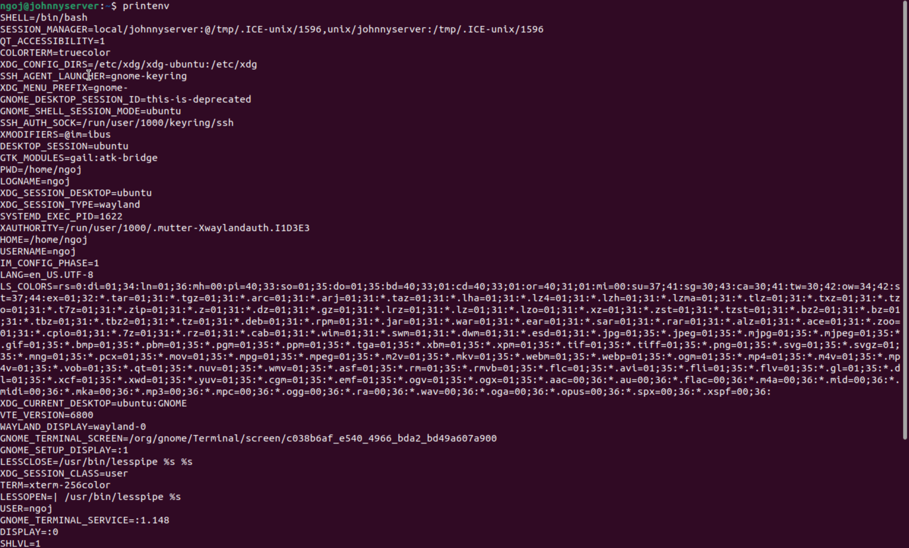

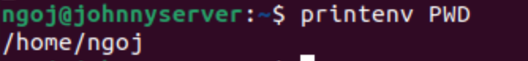

Using the command, `printenv PWD` prints the current working directory.

**Command (Set an ENV):**
```bash
export <ENV>=<Value>
```

This command will create an environment variable that is accessible to all shells like bash, zh, and sh.

**Command (Unset an ENV):**
```bash
unset <ENV>
```

This command will remove an environment variable's value.

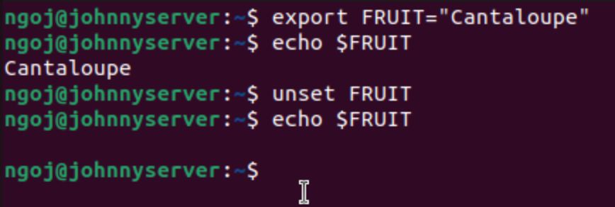

Here, I set an environment variable named, `FRUIT`, to the value,`Cantaloupe`, and then printed using `echo $FRUIT` to verify it was set correctly. Once I confirmed, I used unset to remove the environment variable's value and then printed its value again, resulting in no output.

## 2. Passing Environment Variables from Parent Process to Child Process

This section highlights how a child process inherits its environment variables from its parent process. 

Unix uses `fork()` to create child processes. These are processes are duplicates from the parents, but several things are not inherited. I wanted to know if child processes inherit environment variables.

First, I compiled and ran the program, `myprintenv.c` provided in `Labsetup.zip`. This program prints out the environment variables available from either a child or a parent process. Initially, this program prints the child process's environment variables.


Compiling `myprintenv.c` with `gcc myprintenv.c` produced an executable named `a.out`.

I then ran `a.out` and redirected the output to a file using `./a.out > file`. 

Next, I had to modify the same program, `myprintenv.c` and repeat the same steps as before. This time, I modified it to now print the parent process's environment variables. The output from this second run was saved to another file named `file2`.

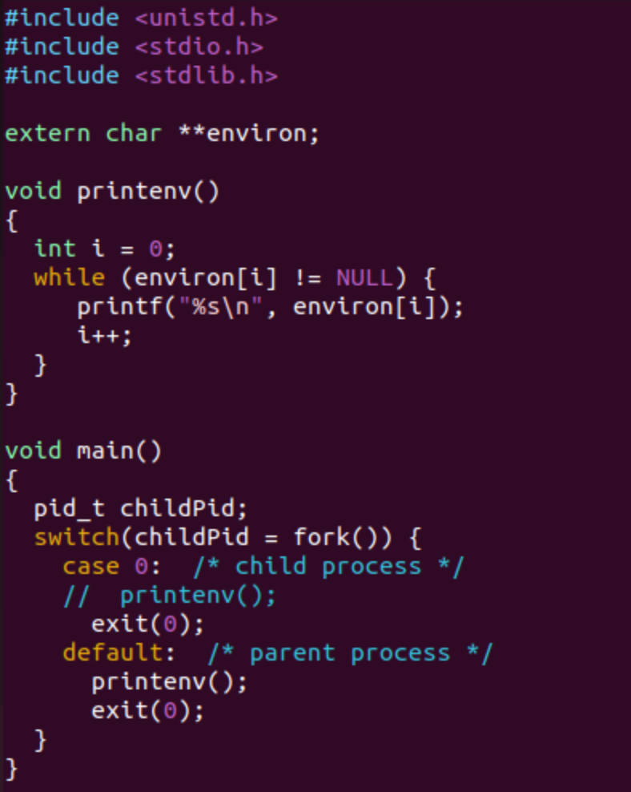

Finally, using the `diff` command, I compared the outputs from `file` and `file2`.


Running `diff file file2` resulted in no output in the console, meaning that the environment variables from `file` and `file2` were the same. I concluded that child processes inherit environment variables from their parent processes.

## 3. Environment Variables and `execve()`

This section examines how environment variables are affected when a program is executed using the `execve()` function.

This function runs a new program in the calling process. I am interested if the environment variables are inherited by this new program.

From the `Labsetup.zip` folder, I compiled a program named `myenv.c`, which is shown in the image below. 

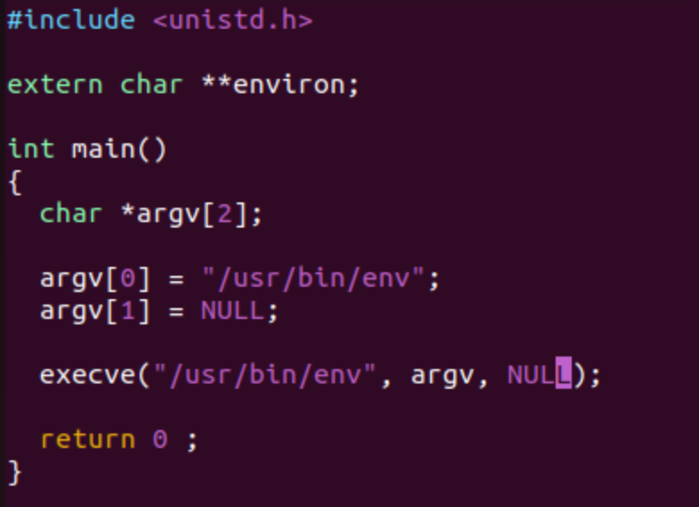

I then ran this program and got the output below, where nothing was printed in the console.

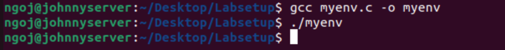

I then modified `myenv.c` to where I changed the third argument, `NULL`, to `environ`.

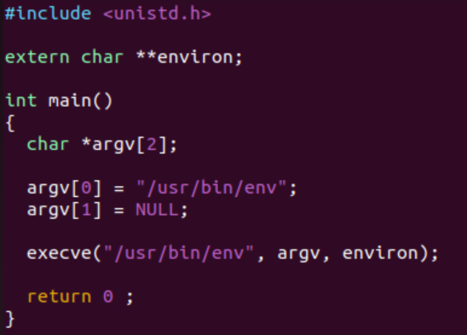

Running this version of the program resulted in a list on environment variables getting printed in the console.

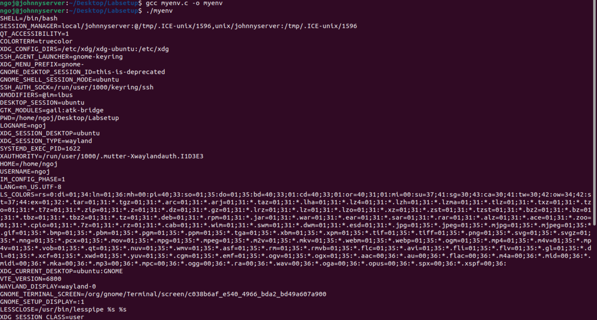

From what I have gathered, passing `NULL` for the third argument of `execve()` prevents any environment variables being passed to the new program. When `environ` is passed instead, the new program inherits the environment variables from the calling process. Therefore, execve() does not automatically inherit environment variables. They must be explicitly provided first.

## 4. Environment Variables and `system()`

This section explores how environment variables are affected using the `system()` function.

The function is used to execute a command like `execve()`, but instead of directly executing it, it uses the shell to execute it through: `/bin/sh -c <command>`.

I wrote a program called `systemtest.c` to test out the `system()` function as shown below.

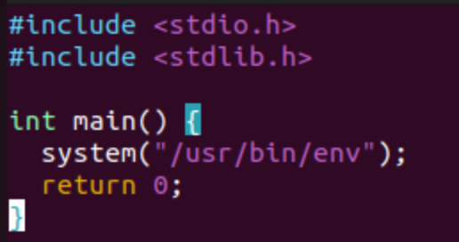

I then compiled and ran this program, which produced a list of environment variables.

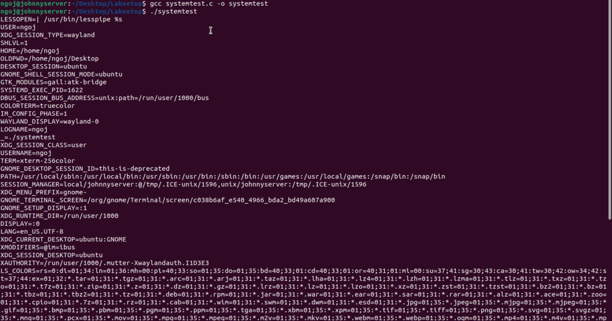

What this tells me is regardless of whether arguments are provided to pass environment variables, `system()` automatically inherits the environment variables of the calling process.

## 5. Environment Variables and `Set-UID` Programs

`Set-UID` programs are special programs that run with the privileges of the file owner, rather than the privileges of the user that executes them. This allows users to perform tasks that normally would need higher permissions, which could be risky if a user acts maliciously. I wanted to know if environment variables from the user's process are inherited by the `set-UID` program's process.

To start, I first created a program named `printprocessenvs` that prints out all the environment variables in the current process.

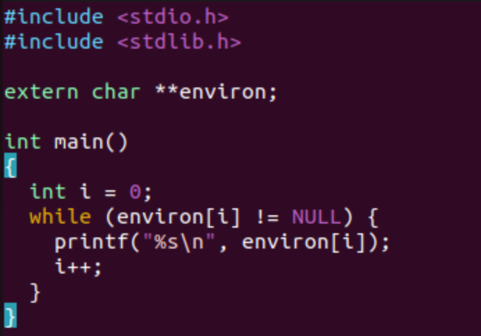

Then, I compiled this program, changed its owner to be the root user, and made it into a `set-UID` Program.


Once I that was done, I set three environment variables: `PATH`, `LD_LIBRARY_PATH`, and my own custom environment variable.

- `PATH` was set to be `/some/test:$PATH`.
- `LD_LIBRARY_PATH` was set to be `/home/attacker/evil_libs`.
- An environment variable, `SHOE`, was set to be `Sneaker`.

I then ran the `set-UID` program, which outputted a list of environment variables.


To easily check if the variables I set were in this output, I ran the command: `./printprocessenvs | grep <Environment Variable>` for each environment variable.


What I found was:

- The modified `PATH` value was displayed.
- `LD_LIBRARY_PATH` did not have an output.
- The `SHOE` environment variable and value were displayed.

From these outputs, I determined that `set-UID` programs do inherit some of the user's environment variables, but not all of them. It was surprising to see that one of the variables, `LD_LIBRARY_PATH`, was not inherited, but this could be because an attacker can set that environment variable to a fake library with malicious code.

## 6. The PATH Environment Variable and `Set-UID` Programs

This section demonstrates how an attacker can exploit the environment variable, `PATH`, in `set-UID` programs to run malicious programs and gain higher privileges.

Calling `system()` within a`set-UID` program can be risky as its invoked shell can be affected by environment variables. This could allow an attacker to run unintended programs with elevated privileges.

To illustrate this risk, I created a vulnerable program named `systemtest2` to run the `ls` command.

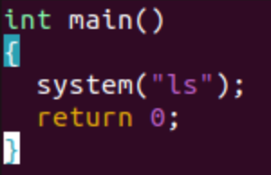

Next, I made this program into a `set-UID` program owned by `root`.


Then, I created the malicious program named `ls`(same name as intended command in the vulnerable program), which attempts to execute the root shell when executed.

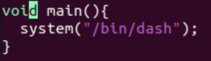

After compiling this program, I modified the `PATH` environment variable, where I ran the command: `export PATH=.:$PATH`. What this tells the `PATH` environment variable to do is to check the current directory the user is in before checking the other system directories.


Finally, I could execute my vulnerable program, which resulted in the output below.


From what I observed, it the malicious program did execute, but the `root` shell was not opened. Instead, a regular `dash` shell has been opened as indicated by the single `$`. This is a preventative measure so that normal users cannot get to the `root` shell.

If I try to type in the `ls` command, a `dash` shell is opened like with running the vulnerable program.


To summarize, when the vulnerable program ran, the `system()` function opened a new shell and looked for the `ls` command in the `PATH` environment variable. Because `PATH` was manipulated to first check my current directory first before, it found a malicious program that was also named `ls` and executed it. Although a `dash` shell instead of the `root` shell, this example still illustrates the risk with `set-UID` root programs.


