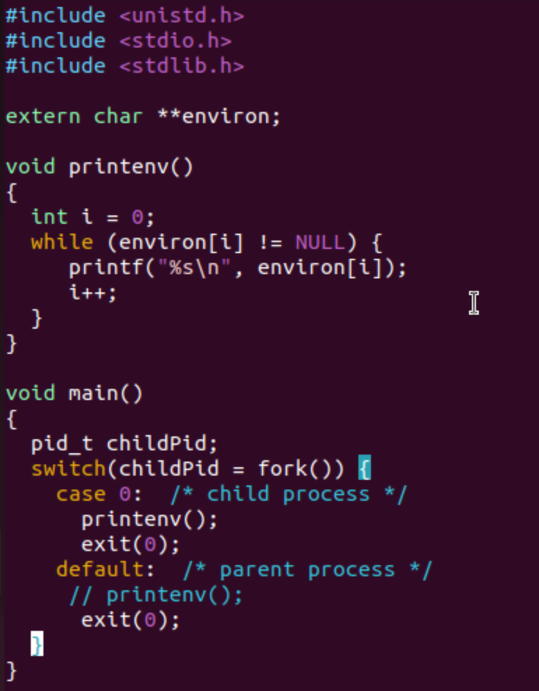
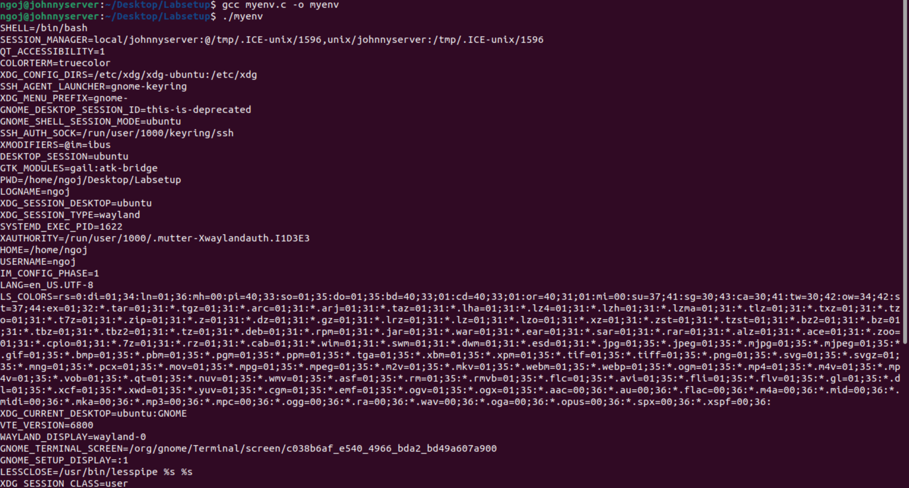
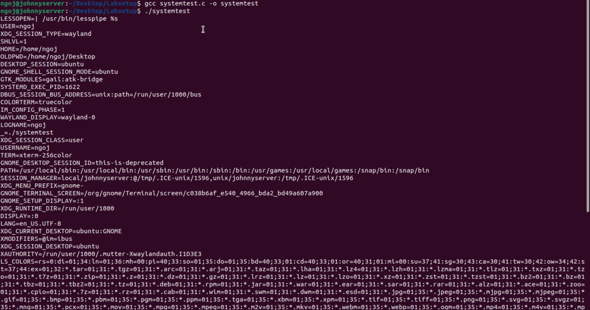
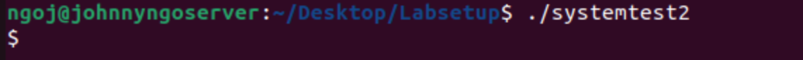
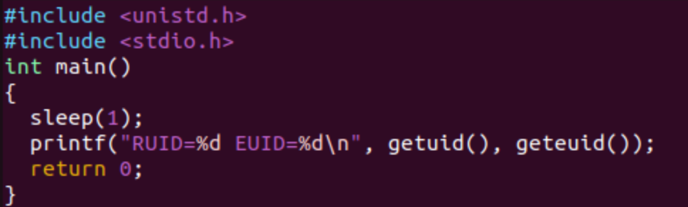
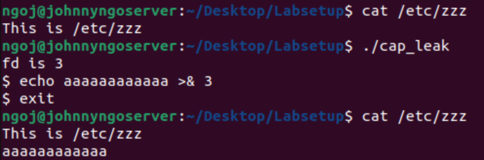

# Lab Source
This lab follows the SEED Lab exercise: [Environment Variable and Set-UID Lab](https://seedsecuritylabs.org/Labs_20.04/Files/Environment_Variable_and_SetUID/Environment_Variable_and_SetUID.pdf), which provides instructions for exploring environment variables and Set-UID behavior in Linux.

## 1. Manipulating Environment Variables

**Command (Print):**
```bash
printenv <environment variable (optional)>
```

- This command will print out environment variables in the console. 
- Running `printenv` without any arguments prints all the environment variables.
- Providing a specific variable's name as an argument will only print that variable's value.


Using the command, `printenv PWD` prints the current working directory.

**Command (Set an ENV):**
```bash
export <ENV>=<Value>
```

This command will create an environment variable that is accessible to all shells like bash, zh, and sh.

**Command (Unset an ENV):**
```bash
unset <ENV>
```

This command will remove an environment variable's value.


Here, I set an environment variable named, `FRUIT`, to the value,`Cantaloupe`, and then printed using `echo $FRUIT` to verify it was set correctly. Once I confirmed, I used unset to remove the environment variable's value and then printed its value again, resulting in no output.

## 2. Passing Environment Variables from Parent Process to Child Process

This section highlights how a child process inherits its environment variables from its parent process. 

Unix uses `fork()` to create child processes. These are processes are duplicates from the parents, but several things are not inherited. I wanted to know if child processes inherit environment variables.

First, I compiled and ran the program, `myprintenv.c` provided in `Labsetup.zip`. This program prints out the environment variables available from either a child or a parent process. Initially, this program prints the child process's environment variables.



Compiling `myprintenv.c` with `gcc myprintenv.c` produced an executable named `a.out`.

I then ran `a.out` and redirected the output to a file using `./a.out > file`. 

Next, I had to modify the same program, `myprintenv.c` and repeat the same steps as before. This time, I modified it to now print the parent process's environment variables. The output from this second run was saved to another file named `file2`.


Finally, using the `diff` command, I compared the outputs from `file` and `file2`.


Running `diff file file2` resulted in no output in the console, meaning that the environment variables from `file` and `file2` were the same. I concluded that child processes inherit environment variables from their parent processes.

## 3. Environment Variables and `execve()`

This section examines how environment variables are affected when a program is executed using the `execve()` function.

This function runs a new program in the calling process. I am interested if the environment variables are inherited by this new program.

From the `Labsetup.zip`, I compiled a program named `myenv.c`, which is shown in the image below. 


I then ran this program and got the output below, where nothing was printed in the console.


I then modified `myenv.c` to where I changed the third argument, `NULL`, to `environ`.


Running this version of the program resulted in a list on environment variables getting printed in the console.



From what I have gathered, passing `NULL` for the third argument of `execve()` prevents any environment variables being passed to the new program. When `environ` is passed instead, the new program inherits the environment variables from the calling process. Therefore, `execve()` does not automatically inherit environment variables. They must be explicitly provided first.

## 4. Environment Variables and `system()`

This section explores how environment variables are affected using the `system()` function.

The function is used to execute a command like `execve()`, but instead of directly executing it, it uses the shell to execute it through: `/bin/sh -c <command>`.

I wrote a program called `systemtest.c` to test out the `system()` function as shown below.


I then compiled and ran this program, which produced a list of environment variables.



What this tells me is regardless of whether arguments are provided to pass environment variables, `system()` automatically inherits the environment variables of the calling process.

## 5. Environment Variables and `Set-UID` Programs

`Set-UID` programs are special programs that run with the privileges of the file owner, rather than the privileges of the user that executes them. This allows users to perform tasks that normally would need higher permissions, which could be risky if a user acts maliciously. I wanted to know if environment variables from the user's process are inherited by the `set-UID` program's process.

To start, I first created a program named `printprocessenvs` that prints out all the environment variables in the current process.


Then, I compiled this program, changed its owner to be the root user, and made it into a `set-UID` Program.


Once I that was done, I set three environment variables: `PATH`, `LD_LIBRARY_PATH`, and my own custom environment variable.

- `PATH` was set to be `/some/test:$PATH`.
- `LD_LIBRARY_PATH` was set to be `/home/attacker/evil_libs`.
- An environment variable, `SHOE`, was set to be `Sneaker`.

I then ran the `set-UID` program, which outputted a list of environment variables.


To easily check if the variables I set were in this output, I ran the command `./printprocessenvs | grep <Environment Variable>` for each environment variable.


What I found was:

- The modified `PATH` value was displayed.
- `LD_LIBRARY_PATH` did not have an output.
- The `SHOE` environment variable and value were displayed.

From these outputs, I determined that `set-UID` programs do inherit some of the user's environment variables, but not all of them. It was surprising to see that one of the variables, `LD_LIBRARY_PATH`, was not inherited, but this could be because an attacker can set that environment variable to a fake library with malicious code.

## 6. The `PATH` Environment Variable and `Set-UID` Programs

This section demonstrates how an attacker can exploit the environment variable, `PATH`, in `set-UID` programs to run malicious programs and gain higher privileges.

Calling `system()` within a`set-UID` program can be risky as its invoked shell can be affected by environment variables. This could allow an attacker to run unintended programs with elevated privileges.

To illustrate this risk, I created a vulnerable program named `systemtest2` to run the `ls` command.


Next, I made this program into a `set-UID` program owned by `root`.


Then, I created the malicious program named `ls`(same name as intended command in the vulnerable program), which attempts to execute the root shell when executed.


After compiling this program, I modified the `PATH` environment variable, where I ran the command: `export PATH=.:$PATH`. What this tells the `PATH` environment variable to do is to check the current directory the user is in before checking the other system directories.


Finally, I could execute my vulnerable program, which resulted in the output below.



From what I observed, it the malicious program did execute, but the `root` shell was not opened. Instead, a regular `dash` shell has been opened as indicated by the single `$`. This is a preventative measure so that normal users cannot get to the `root` shell.

If I try to type in the `ls` command, a `dash` shell is opened like with running the vulnerable program.


To summarize, when the vulnerable program ran, the `system()` function opened a new shell and looked for the `ls` command in the `PATH` environment variable. Because `PATH` was manipulated to first check my current directory first before, it found a malicious program that was also named `ls` and executed it. Although a `dash` shell instead of the `root` shell, this example still illustrates the risk with `set-UID` root programs.

## 7. The `LD_PRELOAD` Environment Variable and `Set-UID` Programs

This section explains how the dynamic loader/linker can be exploited to run malicious programs.

The dynamic loader/linker is a component of the operating system that is responsible for loading and linking shared libraries required by an executable at run time. One way it does this is by using the environment variable, `LD_PRELOAD`, which specifies additional, user-specified, shared libraries to be loaded before others. If misused, this variable can allow attackers to inject and execute malicious code.

To present how this environment variable can be manipulated, the following experiment was performed below.

A program named `mylib.c` was created to implement a fake `sleep()` function.


I compiled this program into a library using the commands: `gcc -fPIC -g -c mylib.c` and `gcc -shared -o libmylib.so.1.0.1 mylib.o -lc`.

Once compiled, I set the `LD_PRELOAD` environment variable to point to my fake library using the command: `export LD_PRELOAD=./libmylib.so.1.0.1`.

I then created and compiled a program, `myprog.c` that uses the `sleep()` function.



This program also prints the real user ID (`RUID`) and the effective user ID (`EUID`), which will be discussed later.

After creating and compiling `myprog.c`, I ran it under four conditions:

1. As a regular program, run by a normal user.


2. As a`set-UID` root program, run by a normal user.


3. As a `set-UID` root program, run by the root user.


4. As a `set-UID` normal-user program, run by a different normal user.


From the outputs, conditions 1 and 3 ran the `sleep()` function from the fake library, while conditions 2 and 4 ran the real `sleep()` function.

This difference occurs because the dynamic linker has a security mechanism to prevent it from loading malicious or unauthorized libraries. Specifically, for `set-UID` programs, it ignores the `LD_PRELOAD` (and `LD_LIBRARY_PATH`) environment variables when the effective user ID (`EUID`) and the real user ID (`RUID`) differ. In these cases, the linker will load in trusted libraries instead of user-specified ones.

The only exception occurs when the program owner runs the `set-UID` with `LD_PRELOAD` pointing to a fake library, as occurred in condition 3.

For regular programs, the dynamic linker always applies the `LD_PRELOAD` environment variable, so user-specified libraries can be loaded normally.

## 8. Invoking External Programs Using `system()` Versus `execve()`

This section focuses on the use of `system()` compared to `execve()`. It does not cover environment variable manipulation.

Both functions can be used to run new programs, but `system()` can be dangerous if used in privileged programs, such as `set-UID` programs, because it invokes a new shell.

The `Labsetup.zip` includes a program named `catall.c`. I first compiled it with `system()` enabled and set it as a `set-UID` root-owned program.


Once the program was set up, I created two dummy files: `hello.txt` and `randomfile.txt` to use for testing.

I then ran the command: `./catall hello.txt; rm randomfile.txt` which displayed the following output:


This displayed the contents of `hello.txt` and also removed `randomfile.txt.`

This behavior demonstrates the dangers of using `system()`. Because `system()` invokes a shell, it interprets the input as a full shell command rather than a single argument. In this case, what was intended to be a single filename argument (`hello.txt`) was treated as two commands (`./catall hello.txt` and `rm randomfile.txt`), allowing unintended actions to occur.

Although in this scenario `randomfile.txt` was removed, `./catall` is a `set-UID` root owned program. If an attacker can control an input to this program, they could modify or delete sensitive files, such as `/etc/passwd`, and break the system.

After testing this program with `system()`, I recompiled it to use `execve()` and repeated the same steps. I created the same dummy files (`hello.txt` and `randomfile.txt`) and ran `./catall hello.txt; rm randomfile.txt`.

This is the output displayed when testing the program with `execve()`:


Running `./catall hello.txt; rm randomfile.txt` with `execve()` threw an error stating no such file or directory exists. Unlike `system()`, `execve()` does not invoke a shell, so the input was treated as a single argument, preventing unintended actions such as removing a file.

## 9. Capability Leaking

Sometimes, `set-UID` programs grant elevated permissions for a user when they need to perform certain tasks. Once those privileged operations are completed, these programs often relinquish their privileges if they are no longer needed. Typically, this is done by setting the `EUID` to the user's `RUID`.

However, one problem that can occur when downgrading privileges is capability leaking, where a user retains privileged capabilities even after those privileges are relinquished.

In this example, a file descriptor is used to illustrate how privilege leakage can occur.

In the `Labsetup.zip` folder, there is a file named `cap_leak.c`, which I compiled, changed its owner to root, and made into a `set-UID` program.


I also created a dummy system file named `etc/zzz`, which was owned by root and had octal permissions 0644.

After I created the dummy file, I ran the compiled `cap_leak.c` program, to which it opened a `dash` shell and printed a file descriptor number. From that shell, I executed the command, `echo aaaaaaaaaaaa >& 3` and exited. Finally, I inspected `/etc/zzz` and found that the string, `aaaaaaaaaaaa`, had been appended to the file.



To clarify what happened, the program opened a file descriptor with privileges to write to `/etc/zzz` while running as root. It then downgraded its privileges, but the file descriptor that can write to that file was still open for a normal user. Since the descriptor was still open, the user in the unprivileged shell can still write to that file.

In order to prevent a situation like this, the privileged file descriptor should have been closed before downgrading privileges. That way, the user in the unprivileged shell will not have access to it anymore and write to the file.

In general, any `set-UID` program that downgrades privileges should clear any privileged capabilities and ensure no sensitive resources remain accessible to the user.