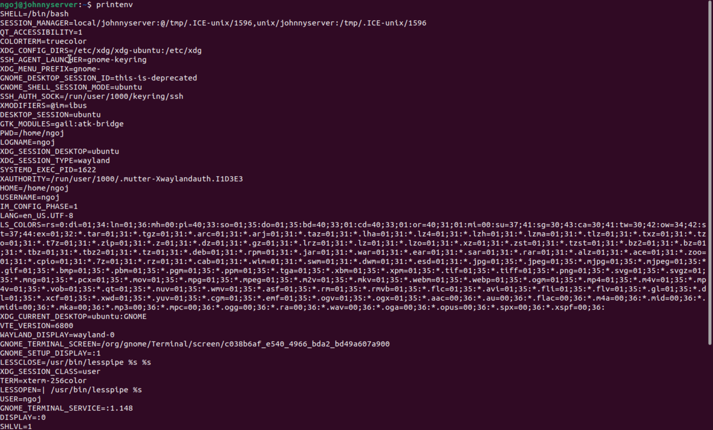
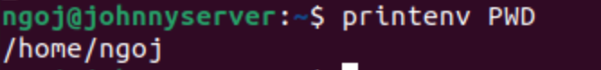
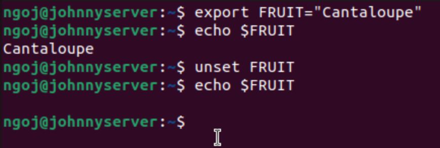
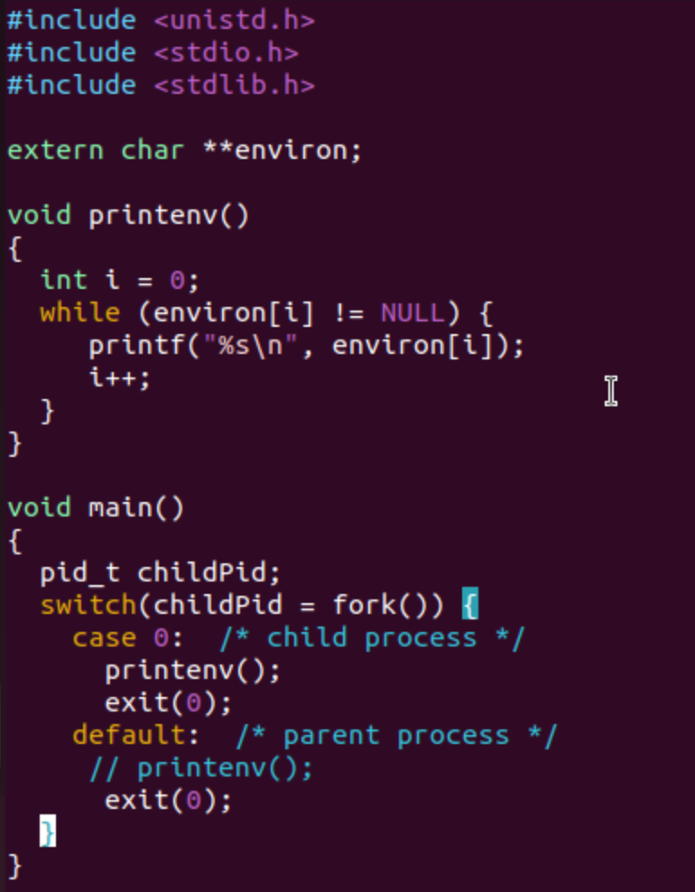
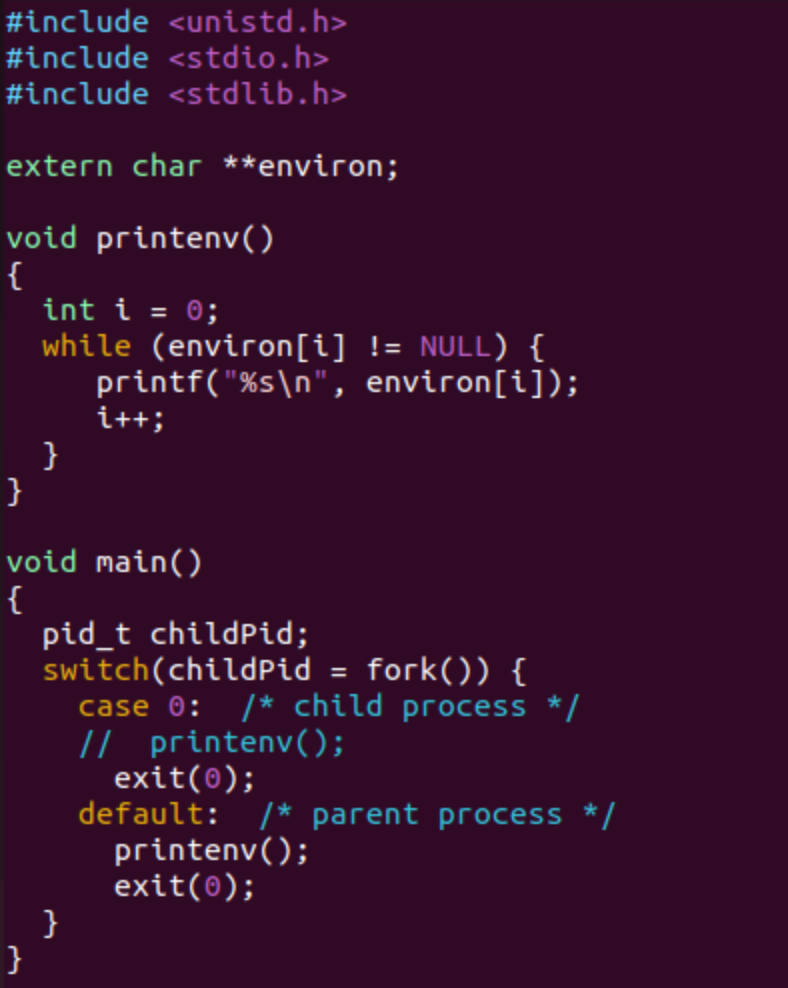

# Lab Source
This lab follows the SEED Lab exercise: [Environment Variable and Set-UID Lab](https://seedsecuritylabs.org/Labs_20.04/Files/Environment_Variable_and_SetUID/Environment_Variable_and_SetUID.pdf), which provides instructions for exploring environment variables and Set-UID behavior in Linux.

## 1. Manipulating Environment Variables

**Command (Print):**
```bash
printenv <environment variable (optional)>
```

- This command will print out environment variables in the console. 
- Running `printenv` without any arguments prints all the environment variables.
- Providing a specific variable's name as an argument will only print that variable's value.





Using the command, `printenv PWD` prints the current working directory.

**Command (Set an ENV):**
```bash
export <ENV>=<Value>
```

This command will create an environment variable that is accessible to all shells like bash, zh, and sh.

**Command (Unset an ENV):**
```bash
unset <ENV>
```

This command will remove an environment variable's value.



Here, I set an environment variable named, `FRUIT`, to the value,`Cantaloupe`, and then printed using `echo $FRUIT` to verify it was set correctly. Once I confirmed, I used unset to remove the environment variable's value and then printed its value again, resulting in no output.

## 2. Passing Environment Variables from Parent Process to Child Process

This section highlights how a child process inherits its environment variables from its parent process. 

Unix uses `fork()` to create child processes. These are processes are duplicates from the parents, but several things are not inherited. I wanted to know if child processes inherit environment variables.

First, I compiled and ran the program, `myprintenv.c` provided in `Labsetup.zip`. This program prints out the environment variables available from either a child or a parent process. Initially, this program prints the child process's environment variables.



Compiling `myprintenv.c` with `gcc myprintenv.c` produced an executable named `a.out`.

I then ran `a.out` and redirected the output to a file using `./a.out > file`. 

Next, I had to modify the same program, `myprintenv.c` and repeat the same steps as before. This time, I modified it to now print the parent process's environment variables. The output from this second run was saved to another file named `file2`.



Finally, using the `diff` command, I compared the outputs from `file` and `file2`.


Running `diff file file2` resulted in no output in the console, meaning that the environment variables from `file` and `file2` were the same. I concluded that child processes inherit environment variables from their parent processes.

