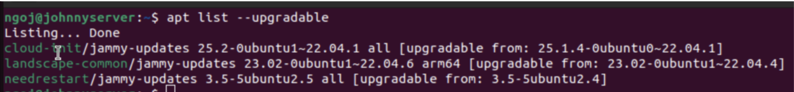

# 1. Searching for Available Updates

**Command:**
```bash
apt list --upgradable 
```

This command lists all the packages on my system that have available updates. For each package, it shows:

- Package name - The software package that can be updated.

- Repository - The source where the updated package comes from.

- Architecture - The system type this update applies to.

- Current version - The version current installed.

- New version - The version available in the repository that can be installed



### For the second listing:

- The package name is landscape-common.

- The repository is jammy-updates.

- The architecture this update is available is arm64.systems

- The current version of this package is 23.02-0ubuntu1-22.04.4

- The new version of this package is 23.02-0ubuntu1-22.04.6