## 1. Searching for Available Updates

**Command:**
```bash
apt list --upgradable 
```

This command lists all the packages on my system that have available updates. For each package, it shows:

- Package name - The software package that can be updated.

- Repository - The source where the updated package comes from.

- Architecture - The system type this update applies to.

- Current version - The version current installed.

- New version - The version available in the repository that can be installed


### For the second listing:

- The package name is landscape-common.

- The repository is jammy-updates.

- The architecture this update is available is arm64.systems

- The current version of this package is 23.02-0ubuntu1-22.04.4

- The new version of this package is 23.02-0ubuntu1-22.04.6

## 2. Updating and Upgrading the System

**Command (update):**
```bash
sudo apt update
```

Using this command will download the latest package information from all my configured sources. This command will not upgrade any of those packages.

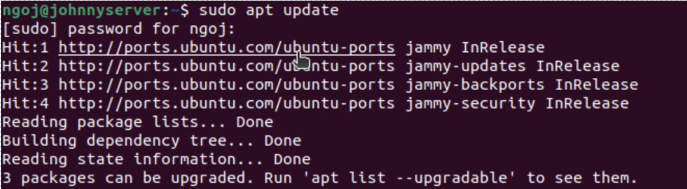

**Command (upgrade):**
```bash
sudo apt upgrade
```

This command will install all packages to their latest versions based on the updated package list.

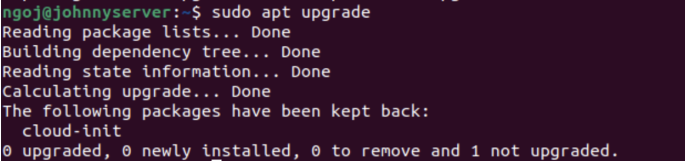

**Note:**

One package, ```cloud-init```, was shown as "*held back.*" This is normal behavior for virtual machines and can be ignored.

## 3. Rebooting the System

**Command:**
```bash 
sudo reboot
```

This command restarts my system. It is also usually necessary to run it to ensure all updates were fully applied.

# Users and Permissions

## 4. Changing to the Root User

**Command:**
```bash
sudo su root
```

Using this command switches the current user, ```ngoj```, to the root user. The prompt of the root user has a different color and style from a normal user, and it also is indicated by a ```#``` instead of ```$```.

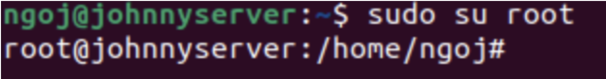

## 5. Creating New Users

There are two options to create a new user in Linux:

**Command 1:**
```bash
sudo useradd <username>
```

**Command 2:**
```bash
sudo adduser <username>
```

The first option, `sudo useradd username`,
is a built in Linux Command that directly adds a new user to the /etc/passwd file, but it does not create a home directory or a password for the user. 

The second option, `sudo adduser username`,
is a Perl script that utilizes useradd, and it guided me through creating a home directory and a password for the new user.

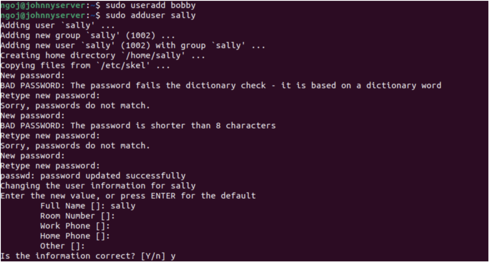

In this picture, I added `bobby` with `useradd` and `sally` with `adduser`.

## 6. Changing the Current User

**Command:**

```bash
su <username>
```

Using this command will switch the current user to another user.

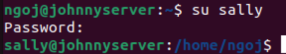

Here, I changed my current user to `sally`. In order to do this, however, I had to enter her password.

## 7. Attempting to Create a User Using a Different Account

While being logged in as `sally`, using the command, `sudo adduser earl`, will print the message, "*sally is not in the sudoers file. This incident will be reported*". This happens since `sally` does not have sudo privileges, so she cannot execute administrative commands with elevated permissions.

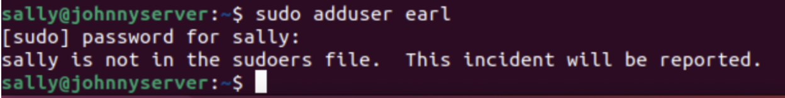

## 8. Deleting a User

**Command:**

```bash
sudo userdel earl
```

Returning to my original user, `ngoj`, I added `earl` as a new user, and then used the command `sudo userdel earl`, to delete the user.

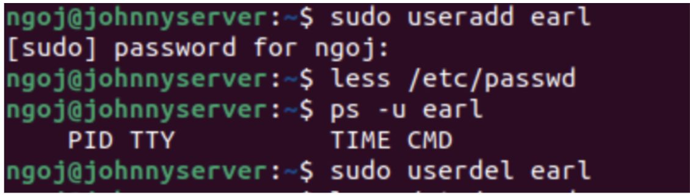

**Note:**

The additional commands`less /etc/passwd` and `ps -u earl`, are not necessary for this task and can be ignored.

## 9. Changing a User's Password

**Command:**
```bash
sudo passwd <username>
```

Using the command above, I changed `sally`'s password. To check if her password successfully changed, I logged into her account using the new password.

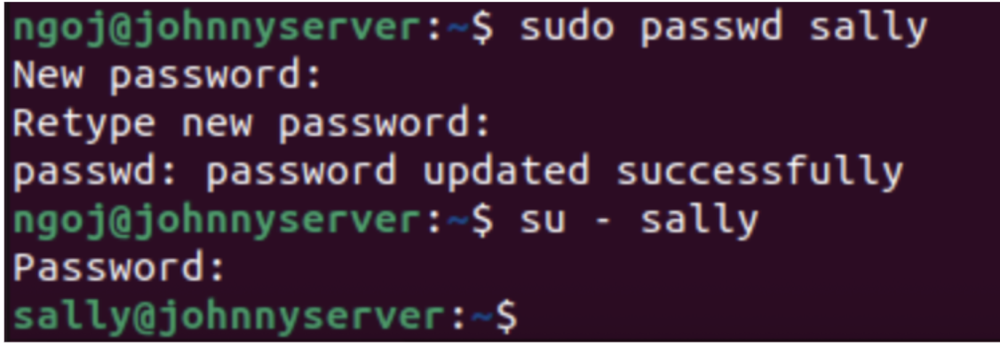

## 10. Using a Non-Root User

For the rest of the tasks, I used the `ubuntu` user.

All of the commands in the Linux Command Line can be easily executed using the root user, but it is a bad practice because:

- Root can modify any file or setting, including sensitive files like `etc/passwd`. Serious consequences can occur if sensitive files are modified accidentally.
- It improves security, as malicious scripts and commands have limited permissions.

It is best to instead use `sudo` to execute any command with administrative privileges instead, and root should only be used as a last resort or when absolutely necessary.

## 11. Finding my User Id

**Command:**
```bash
id
```

This command will display the user id, which is also named as `uid`. Other information is displayed alongside it.

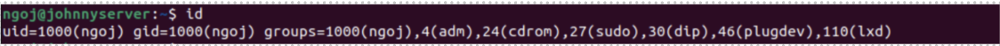

My `uid` has a value of 1000.

# Groups

## 12. Finding the Groups Ubuntu Belongs to

**Command:**

```bash
groups
```

This command will list out all the groups Ubuntu belongs to.

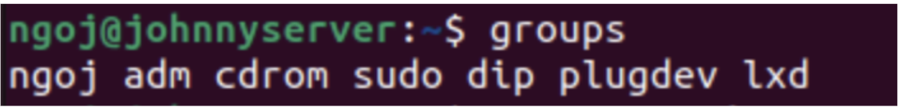

Ubuntu is in seven groups: `ngoj`, `adm`, `cdrom`, `sudo`, `dip`, `plugdev`, and `lxd`. 

## 13. Giving a User the Ability to Execute Sudo Commands

**Command:**

```bash
sudo usermod -aG sudo <username>
```

Using this command, I can make a user run `sudo` commands by adding them into the `sudo` group.
- `-aG` means: append (`-a`) the user to a specific group (`-G`).

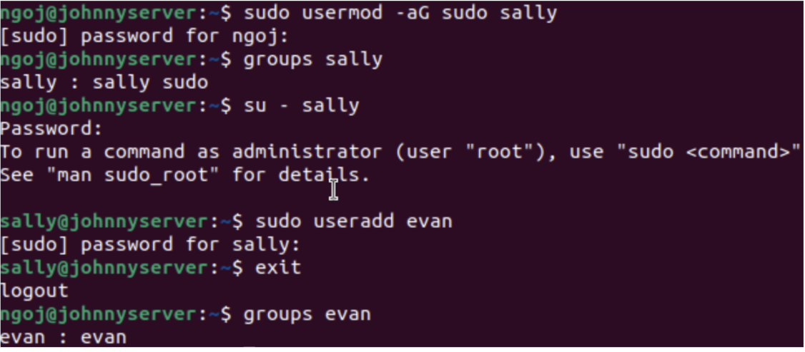

In this example, I added `sally` to the `sudo` group. To test if she can execute sudo command, I added a new user, `evan`, under her account. I then checked `evan`'s group membership with the command: `groups evan`, which confirmed that this user was successfully created.

## 14. Creating a New Group

**Command:**

```bash
sudo groupadd <group>
```

The command above will create a new group in the system.


I used this command to create a new group called `cybersec`.


